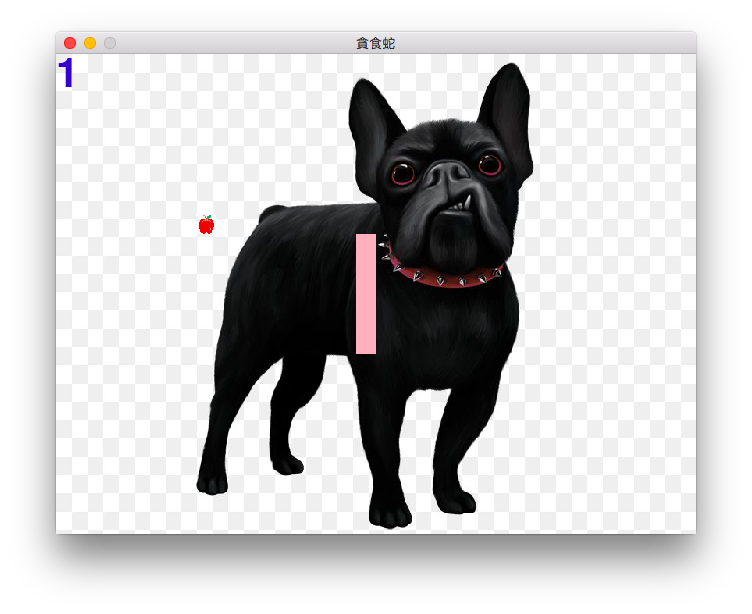

# My Project

## What we Learned
- [x] 貪食蛇
- [x] 網頁設計
- [x] 網頁爬蟲
- [x] github

## 貪食蛇

How to run  
> cd snake_game  
> python snake.py  

## 網頁

How to run  
> 1. 找到 web_design 資料夾
> 2. 把index.html 用網頁打開

## 網頁爬蟲
練習: [ptt_nba版](web_spider/nba.csv)

## 資料分析  
練習: [肺炎確診資料](panda/covid.csv)

---

## What we Used
>|專題名稱|程式語言|套件|
>|---|---|---|
>|貪食蛇|Python|Pygame|
>|網頁|html/css/javascript||
>|網頁爬蟲|Python|BeautifulSoup|
>|資料分析|Python|Pandas|
